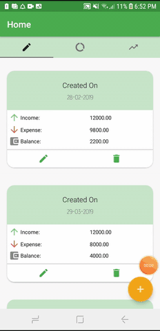
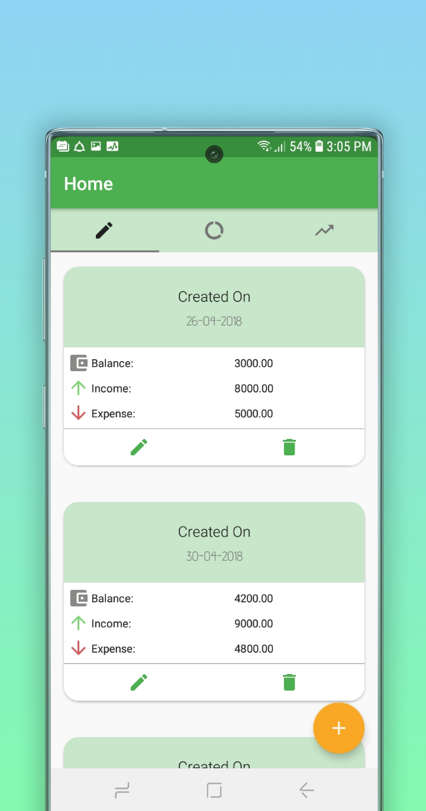
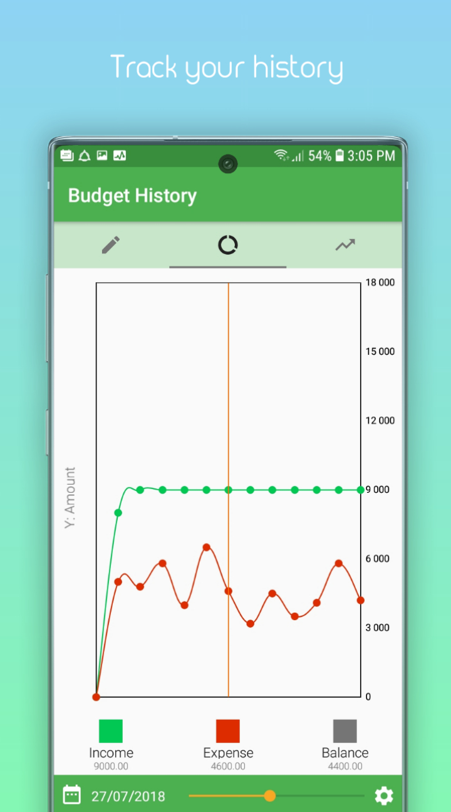
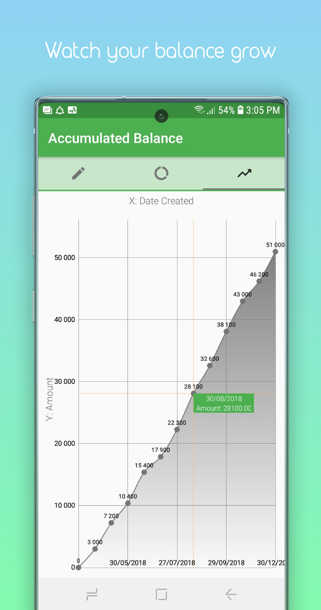
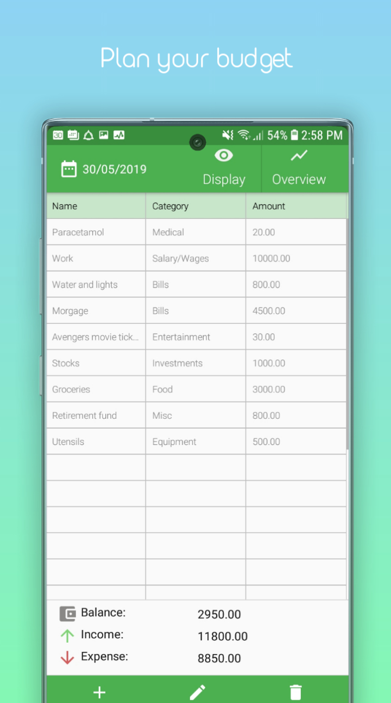
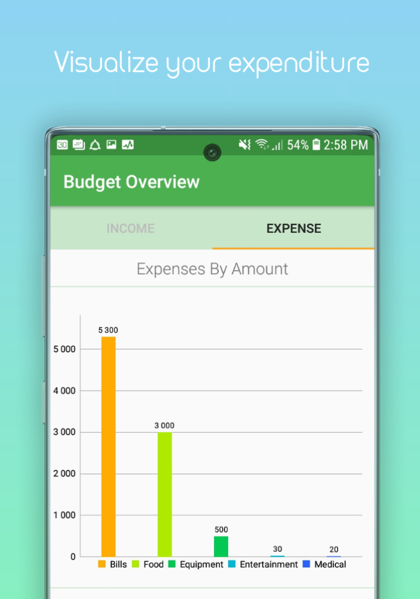

# BudgetPlanner

Description:
A fully functional app designed to help users with creating and maintaining their budgets

# Features include:

* Creating a deleting budgets
* Editing existing budgets
* View income and expense subtotals in terms of graphs
* View the complete history of budgets - including
  - Income, expense, net balance
  - Accumulated balance
  

# What problem does it solve?

The answer- paperless solution for personal finance.
Wouldn't it be nice to have budgets stored in one convenient place without having to use bulky folders? What about auto-generated reports based on the existing budgets that have accumulated over the years? These are some of the thoughts that went through my mind when building this app. Budget Planner aims to address these issues by providing a simple interface which the user can interact with, enabling them to create, edit, and view the financial progress at their finger tips.,

# Architecture

The application follows an MVP architectural design pattern. 
The codebase is divided into view, presenter and model layers. The activities being the view, which listens for different UI events such as button clicks, view pager swipes, recycler view scrolling. These signals are transmitted to the presenter object in which the activities (i.e view) contains a reference to. The presenter contains logic,
to determine what the view needs, for instance requesting data from the local SQLite DB cache. This operation is done
asynchronously using RxJava library, and once completed, makes a callback to the view with the desired results.

This application is divided into activities whose flow goes something like this.
Home Activity -> CurrentBudgetActivity -> SubtotalActivity

# Home Activity - Budget list tab 
A fragment defined in the home activity's view pager.
This fragment contains a recycler view of budgets that the user has recently created.

# UI events
- There is a floating action button when clicked, prompts a request to the home activity's Presenter to create a budget entry using the Repository object contained within the Presenter. This is done on a background thread, using RxJava

- Each entry in the recycler view contains an edit button (depicted with a pencil icon) and a delete button (bin icon)
    - As the user clicks on the edit button, it takes them to the currentbudgetActivity.java activity. This activity displays details about the budget entry.

# Home Activity - History tab

# UI events
- Still part of the home activity view pager, this page contains a scroll bar that displays the selected budget's net income, expense and balance for that particular date it was created in the timeline. The chart used came from a 3rd party library named MPCharts, made by Mike Phil.

- Use the seek bar to select points in the line graph.

- Click on the settings button next to the seek bar to toogle the visibility of the lines.

# Home Activity - Accumulated balance tab

# UI events
- Like the previous tab, this is a chart fragment that displays the accumulated balance the user has earned. This is calculated based on the list of budgets that the user has previously created, and is depicted on a line graph.
The chart has a click listener, that adds a tag to a point on the chart when clicked.

# Current Budget Activity
When the user selects a budget using the edit button or creates a budget from the home page using the '+' floating button, they would be redirected to the current budget activity, which displays the details of the selected budget.

# UI events
- This activity contains a recycler view of budget entries, each of which is sub-divided by column values.
You may add, edit and delete items as you please, as indicated by their corresponding buttons located at the bottom of the activity layout

- Towards the top right corner of the activity's toolbar, you will notice two buttons titled display and overview.
    - Clicking on the Display button brings up the alert dialog fragment that prompts the user to select which columns for each entry should be visible
    - Clicking on the Overview button brings the user to the subtotal activity, which displays the subtotals in of the budget in graphs
   
- Clicking on the calendar icon on the top left of the toolbar would bring out a date picker dialog fragment that the user can interact with to change the creation date of the budget.

 
 # Subtotal activity
 This activity is navigated to from the 'Current Budget Activity' when clicking the 'Overview' button.
 Its responsibility is to simply display income and expense entries of a budget by category. Using Mike Phil's MPCharts library, we can display this aggregate data using Bar charts, and line charts as depicted in the image below.
 
 # Example

# Available now on Google Play
https://play.google.com/store/apps/details?id=com.budget.planner
